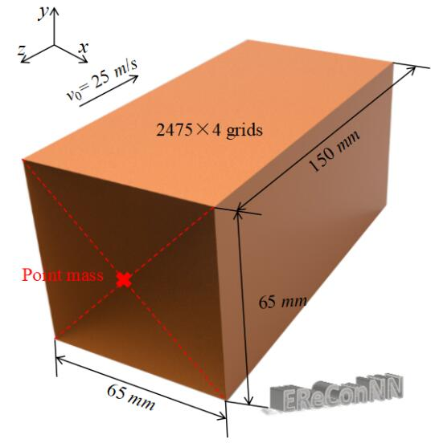
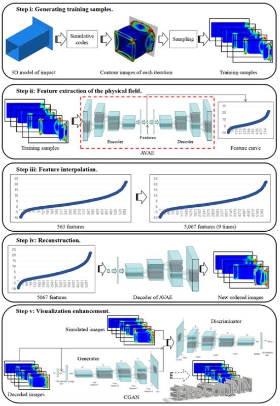

# Image-based-reconstruction-for-physical-fields

  With the improvement of the pattern recognition and feature extraction of Deep Neural Networks (DPNNs), image-based design and optimization have been widely used in multidisciplinary researches. Recently, a [***Reconstructive Neural Network (ReConNN)***](https://www.sciencedirect.com/science/article/pii/S0017931018355017) has been proposed to obtain an image-based model from an analysis-based model. However, it has difficulties handling nonlinear transient impact problems.
  
  Therefore, an improved ReConNN, ***EReConNN***, method is proposed to address the mentioned weaknesses. Time-dependent ordered images can be generated. Furthermore, the improved method is successfully applied in impact simulation case and engineering experiment. Through the experiments, comparisons and analyses, the improved method is demonstrated to outperform the former one in terms of its accuracy, efficiency and costs.

## Problem descriptions

  As shown in the following figure, the 3D Computer Aided Design (CAD) model of the impact problem is presented. The impact body is a cuboid whose material is Al alloy 6,061-T6. It is defined with an initial velocity v0 along the negative direction of the z-axis. Furthermore, a 300 kg point mass is coupled in the center of the other side of the impact surface.



## The architecture of the proposed EReConNN

  As shown in the following figure, Different from the ReConNN whose main tasks are image regression (Convolution in Convolution, CIC) and image generation (Compressed Wasserstein GAN, CWGAN), the EReConNN is mainly composed of feature extraction, physical field reconstruction and visualization enhancement by using the VAE and Conditional GAN (CGAN), respectively.
  * In Step i, the contour image of each iteration during the simulation is collected.
  * Then the VAE is employed to extract the features of the physical field in Step ii.
  * After that, the time-dependent ordered feature values are interpolated in Step iii.
  * Subsequently, all features are decoded by the decoder of the VAE that is trained in Step ii and the time-dependent ordered images can be generated. The reconstruction can be completed.
  * Finally, the CGAN is applied to enhance the visualization of the reconstruction.
  


### VAE
***Coming soon ......***

### CGAN
***Coming soon ......***

### CNN
***Coming soon ......***

# Data-set-of-a-3D-impact-case


The warehouse of the training samples of the EReConNN

The 3D Computer Aided Design (CAD) model of the impact problem is presented. The impact body is a cuboid whose material is Al alloy 6061-T6 as shown in Table 1, and defined with an initial velocity v0 along the negative direction of z-axis. Furthermore, a point mass of 300kg is coupled in the center of the other side of the collision surface, which is marked by using a red cross.


The dataset of the impact process contains 563 images. The pixels of each one is `480x960x3`. You can download the ***picture_480x960_563_samples.7z***, and a dataset with 5,633 samples will be upload subsequently.

## How it is generated
The impact case is simulated by the Abaqus CAE. Then run the script from the `code/` folder. `ABAQUS_script.py`.
The case of the script is a `Thin-Wall structure` in Section 5 of `《High-Accurate Model for Time-Dependent Collision with Few Simulations》`, bu its geometric parameters aredifferent.

```
inte_steps: the simulated iterations of a impact process
impact_time: the impact time
sample_size: number of different design of TW
mesh_size: size of mesh
```

You can generate your own dataset just modify the job name in the `code/` folder. `_abaqus8_.guiLog`:

```
o1 = session.openOdb(name='C:/Temp/Job-6.odb')
```
and then run it.

## How to use
The images are read by ***cv2.imread***, and the read function is ***ImageReader*** in the `code/` folder. `image_reader.py`. The input to the function contains file name, input path, label path, picture format and size. As for the ***size***, in order to improve the universality of the algorithm, each image is re-sized to one of ***size*size*3*** by using the Bilinear Interpolation, so the ***size*** can be adjusted according to demand and its default value is 64.

## Citation policy
Please cite our work if you write a scientific paper using this code and/or dataset.

```latex
@article{
  title={High-Accurate Model for Time-Dependent Collision with Few Simulations},
  author={Yu Li, Hu Wang, Wenquan Shuai, et al},
  journal={arXiv:1905.03229},
  year={2019}
}
```
